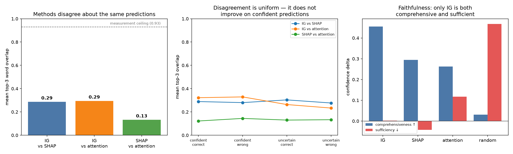
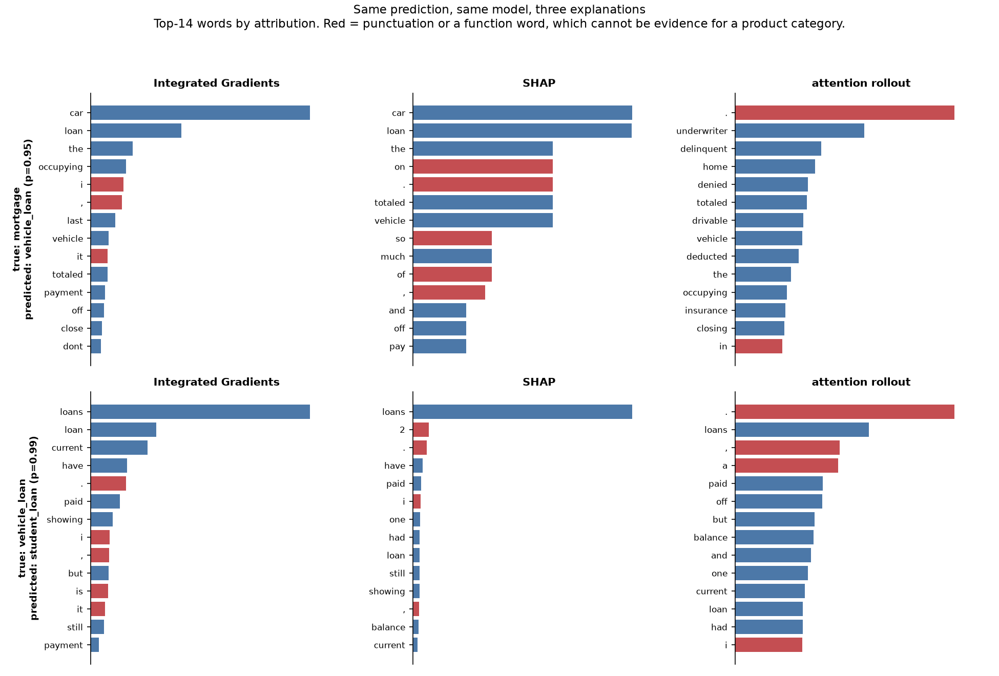
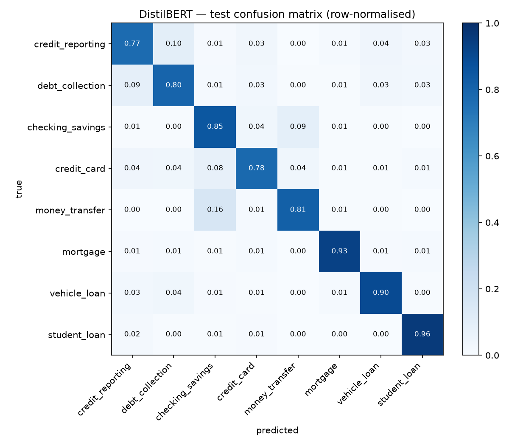

# Do Explanations Actually Explain? Auditing Faithfulness on a High-Stakes Text Classifier

**Three standard explanation methods, run on the same 500 predictions of the same
fine-tuned DistilBERT, agree on only 13–29% of the tokens they call most
important. Faithfulness scoring shows this is not a tie between equally valid
views: in 19.3% of confidently-wrong predictions, attention rollout produced an
explanation that barely moves the model while Integrated Gradients — on the same
example — produced one that does.**

Explainability output is routinely shipped to satisfy regulators and internal
risk teams without anyone checking whether the highlighted tokens reflect the
model's actual decision process. This project fine-tunes a classifier for CFPB
consumer-complaint routing, generates explanations three standard ways, and then
**measures** whether those explanations are faithful — rather than assuming it.

---

## The audit



**Faithfulness** (top-10% of tokens, threshold committed in code before any score
was computed; definitions per DeYoung et al. 2020):

| method | comprehensiveness ↑ | sufficiency ↓ | rationale alone preserves prediction |
|---|---|---|---|
| **Integrated Gradients** | **0.455** | **0.003** | **94.4%** |
| SHAP | 0.294 | −0.043 | 89.4% |
| attention rollout | 0.263 | 0.117 | 82.2% |
| *random tokens (control)* | *0.031* | *0.467* | *46.2%* |

*Comprehensiveness = confidence the model loses when its top-10% tokens are
deleted. Sufficiency = confidence lost when **only** those tokens are kept.*

**The random control is what makes this table readable.** Deleting 10% of any
text moves a prediction somewhat, so a method earns credit only by beating
arbitrary deletion. All three clear it — all three carry real signal — but over
that baseline, attention rollout recovers just **55%** of the faithfulness
Integrated Gradients does.

**Why attention rollout fails, mechanically.** Its top-ranked "evidence" is
frequently not evidence at all:

| method | share of top-3 that is punctuation | explanations containing ≥1 punctuation mark in top-3 |
|---|---|---|
| Integrated Gradients | 2.4% | 7.0% |
| SHAP | 5.9% | 16.4% |
| **attention rollout** | **23.8%** | **67.6%** |

A full stop cannot be evidence for a product category, and deleting one does not
move the model — which is precisely why comprehensiveness is low.



In both walkthroughs — real confidently-wrong predictions — **attention rollout's
single highest-attributed token is a period.** IG and SHAP instead surface
`car` and `loan`, which genuinely explain why a mortgage complaint was routed to
`vehicle_loan`.

### An independent check

Before running any attribution method, error analysis established
**behaviourally** that the model leans on money-service brand names: accuracy on
money-transfer complaints is **0.955** when one is named, **0.533** when not, and
**0.118** on complaints using only bank vocabulary — below the 0.125 random-guess
floor for 8 balanced classes.

That is a rare thing in explainability work: a partial ground truth. Asked to
explain those same predictions, Integrated Gradients places the brand token in
its top-3 **94.6%** of the time, versus **73%** for both SHAP and attention
rollout. A ranking derived from perturbation-based faithfulness and a ranking
derived from model behaviour agree — two independent routes, same conclusion.

### Read overlap against a ceiling, not against 1.0

SHAP at the evaluation budget used here reproduces its own higher-budget ranking
only **93%** of the time, so ~0.93 is the practical maximum any two methods could
show. Against that: IG vs SHAP **0.287**, IG vs attention **0.295**, SHAP vs
attention **0.133** — with SHAP and attention sharing *no* top-3 token at all on
**66%** of examples.

Disagreement is roughly **flat** across confident and uncertain predictions
(0.12–0.33). It does not concentrate in hard cases — which is worse news than if
it did, because it never resolves on the confident predictions a reviewer is most
likely to trust.

---

## The classifier

Multi-class routing of CFPB consumer-complaint narratives into 8 product
categories, balanced at 4,500 each (36,000 total; 25,200 / 5,400 / 5,400).

| | TF-IDF + LogReg | DistilBERT | delta |
|---|---|---|---|
| accuracy | 0.8400 | 0.8496 | +0.0096 |
| **macro-F1** | **0.8411** | **0.8495** | **+0.0084** |

Both scored on the held-out test set. **The gain is statistically marginal**:
McNemar exact *p* = 0.0241, bootstrap 95% CI **[+0.0002, +0.0164]**. DistilBERT
fixes 282 of the baseline's errors and introduces 230 new ones — the two models
fail on largely different examples. Two hours of fine-tuning buys a
resolvable-but-small edge over eleven seconds of bag-of-words.



**Ceiling, not shortfall.** Hand-reviewing 40 errors found ~40% are *mislabelled
ground truth* — the CFPB product field is chosen by the consumer at filing, not
derived from the text, so a complaint entirely about a payment app can be filed
under "Checking or savings account". Another ~30% are genuinely dual-nature (a
collections account appearing on a credit report is one event with two valid
labels) and ~20% have the deciding evidence absent from the input entirely
(redaction removed the brand name, or the label depends on the institution's
registration). **84.95% is close to what this labelling admits**, which is why
the transformer gained ≤0.003 F1 on exactly the confusable classes. Full
taxonomy: [`notebooks/error_analysis.md`](notebooks/error_analysis.md).

---

## Reproducing

```bash
make setup      # uv venv (Python 3.14) + uv pip sync
make test       # 32 tests
make all        # data → train → evaluate → explain → audit → figures
```

`data/splits.json` pins all 36,000 complaint IDs, so `make data` **reproduces the
exact dataset** rather than resampling a newer CFPB snapshot — verified
byte-identical from a clean clone. Use `make data --resample` to draw fresh (and
expect every downstream number to change).

Runtime on an M4 Pro (16 GB, MPS): data ~7 min · train ~2 h 10 m (3-config grid)
· explain ~27 min · audit ~2 min.

**On NFR3.** The BRD budgets <30 min for explanation generation over the full
test set. That is not achievable — Integrated Gradients alone benchmarks at
1.31 s/example, or ~118 min for all 5,400. The audit therefore runs on a
**stratified 500-example set** (~27 min for all three methods), deliberately
oversampling errors to 50% so it reaches the 212 confidently-wrong predictions
where explanations matter most. Every row carries an inverse-sampling weight so
test-set-level claims can be made honestly.

---

## Limitations

- **500 examples, one model, one dataset.** The method *ranking* replicates across
  two independent tests here, but the magnitudes are specific to this setup.
- **Comprehensiveness and sufficiency are proxies.** Deleting tokens produces
  out-of-distribution inputs; a confidence drop may partly reflect that rather
  than lost evidence. The random control bounds this but does not eliminate it.
- **Faithfulness ≠ correctness.** These metrics ask whether an explanation
  reflects the model's computation, not whether the model is right. A faithful
  explanation of a wrong prediction is still faithful — which matters here, since
  ~40% of "errors" are mislabelled.
- **Attention rollout is a deliberately weak baseline.** It is not
  class-conditioned, so the same map explains every class. Its poor showing
  quantifies what class-conditioning is worth; it is not a claim that all
  attention-based methods fail.
- The fine-tuned checkpoint (255 MB) is not committed. All derived results are —
  metrics, attributions, the example set, figures — so the audit is inspectable
  without retraining.

---

## Data, provenance and reuse

**Source.** [CFPB Consumer Complaint Database](https://www.consumerfinance.gov/data-research/consumer-complaints/),
bulk archive fetched 2026-08-06. `data/raw/SOURCE.txt` records the exact snapshot
— URL, byte count and the server's `Last-Modified` — because the database grows
daily and results are only reproducible against a known one. As a work of the US
federal government the database is in the **public domain**; the CFPB publishes
it expressly for research and analysis.

**Complaints are allegations, not findings.** The CFPB does not verify what
consumers write. Narratives reproduced here name companies in the consumer's own
words, and the existence of a complaint is not evidence that the company did
anything wrong. They are used strictly as text-classification inputs. Nothing in
this repository is a claim about any named company.

**Personal data.** The CFPB scrubs personally identifiable information before
publishing, leaving `XXXX` placeholders that `clean_narrative()` then strips. A
scan of all 5,400 redistributed test narratives for email addresses, phone
numbers, SSN patterns, digit runs of 9+, street addresses, URLs and residual
redaction markers returned **no personal data**. No attempt is made to
re-identify anyone, and no derived artifact here adds information the CFPB has
not already published.

**What is redistributed, and why.** The 5,400 test narratives
(`results/predictions_test.parquet`), the 500-example audit set, and the
per-example attributions — so the audit is inspectable without a 2-hour retrain.
Nothing depends on these copies: `data/splits.json` pins all 36,000 complaint
IDs, so `make data` re-fetches from the CFPB directly and reproduces the dataset
byte-identically.

**Licence.** Code and written analysis are MIT ([`LICENSE`](LICENSE)). The
complaint data is public domain and is not licensed by me — cite the CFPB as its
source.

---

## Repo layout

```
src/
├── data_prep.py           # download, clean, dedupe, pinned stratified split
├── train.py               # TF-IDF baseline + DistilBERT fine-tune grid
├── evaluate.py            # error analysis, cached predictions, shortcut audit
├── explain/
│   ├── example_set.py     # the fixed 500 all three methods share
│   ├── common.py          # shared record schema
│   ├── integrated_gradients.py
│   ├── shap_explainer.py
│   └── attention_rollout.py
├── faithfulness.py        # comprehensiveness + sufficiency + random control
├── audit.py               # disagreement, brand-token test, junk-token audit
└── report_figures.py      # example walkthroughs

results/metrics.json       # every number in this README
results/headline_finding.md
notebooks/error_analysis.md
REPORT.md                  # day-by-day working log incl. bugs found
```

Requirements: [`BRD.md`](BRD.md) · Plan: [`PLAN.md`](PLAN.md) · Working log:
[`REPORT.md`](REPORT.md)
