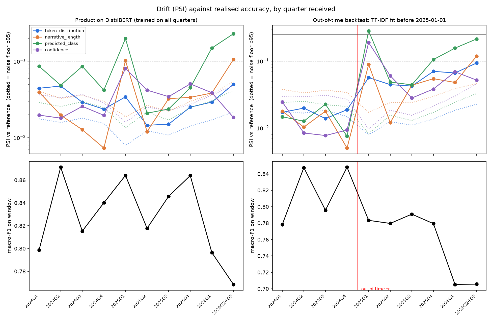

# Do Explanations Actually Explain? Auditing Faithfulness on a High-Stakes Text Classifier

**Three standard explanation methods, run on the same 500 predictions of the same
fine-tuned DistilBERT, agree on only 13–29% of the tokens they call most
important. Faithfulness scoring shows this is not a tie between equally valid
views: in 19.3% of confidently-wrong predictions, attention rollout produced an
explanation that barely moves the model while Integrated Gradients — on the same
example — produced one that does.**

Explainability output is routinely shipped to satisfy regulators and internal
risk teams without anyone checking whether the highlighted tokens reflect the
model's actual decision process. This project fine-tunes a classifier for CFPB
consumer-complaint routing, generates explanations three standard ways, and then
**measures** whether those explanations are faithful — rather than assuming it.

---

## The audit


**Faithfulness** (top-10% of tokens, threshold committed in code before any score
was computed; definitions per DeYoung et al. 2020):

| method | comprehensiveness ↑ | sufficiency ↓ | rationale alone preserves prediction |
|---|---|---|---|
| **Integrated Gradients** | **0.455** | **0.003** | **94.4%** |
| SHAP | 0.294 | −0.043 | 89.4% |
| attention rollout | 0.263 | 0.117 | 82.2% |
| *random tokens (control)* | *0.031* | *0.467* | *46.2%* |

*Comprehensiveness = confidence the model loses when its top-10% tokens are
deleted. Sufficiency = confidence lost when **only** those tokens are kept.*

**The random control is what makes this table readable.** Deleting 10% of any
text moves a prediction somewhat, so a method earns credit only by beating
arbitrary deletion. All three clear it — all three carry real signal — but over
that baseline, attention rollout recovers just **55%** of the faithfulness
Integrated Gradients does.

**Why attention rollout fails, mechanically.** Its top-ranked "evidence" is
frequently not evidence at all:

| method | share of top-3 that is punctuation | explanations containing ≥1 punctuation mark in top-3 |
|---|---|---|
| Integrated Gradients | 2.4% | 7.0% |
| SHAP | 5.9% | 16.4% |
| **attention rollout** | **23.8%** | **67.6%** |

A full stop cannot be evidence for a product category, and deleting one does not
move the model — which is precisely why comprehensiveness is low.


In both walkthroughs — real confidently-wrong predictions — **attention rollout's
single highest-attributed token is a period.** IG and SHAP instead surface
`car` and `loan`, which genuinely explain why a mortgage complaint was routed to
`vehicle_loan`.

### An independent check

Before running any attribution method, error analysis established
**behaviourally** that the model leans on money-service brand names: accuracy on
money-transfer complaints is **0.955** when one is named, **0.533** when not, and
**0.118** on complaints using only bank vocabulary — below the 0.125 random-guess
floor for 8 balanced classes.

That is a rare thing in explainability work: a partial ground truth. Asked to
explain those same predictions, Integrated Gradients places the brand token in
its top-3 **94.6%** of the time, versus **73%** for both SHAP and attention
rollout. A ranking derived from perturbation-based faithfulness and a ranking
derived from model behaviour agree — two independent routes, same conclusion.

### Read overlap against a ceiling, not against 1.0

SHAP at the evaluation budget used here reproduces its own higher-budget ranking
only **93%** of the time, so ~0.93 is the practical maximum any two methods could
show. Against that: IG vs SHAP **0.287**, IG vs attention **0.295**, SHAP vs
attention **0.133** — with SHAP and attention sharing *no* top-3 token at all on
**66%** of examples.

Disagreement is roughly **flat** across confident and uncertain predictions
(0.12–0.33). It does not concentrate in hard cases — which is worse news than if
it did, because it never resolves on the confident predictions a reviewer is most
likely to trust.

---

## The classifier

Multi-class routing of CFPB consumer-complaint narratives into 8 product
categories, balanced at 4,500 each (36,000 total; 25,200 / 5,400 / 5,400).

| | TF-IDF + LogReg | DistilBERT | delta |
|---|---|---|---|
| accuracy | 0.8400 | 0.8496 | +0.0096 |
| **macro-F1** | **0.8411** | **0.8495** | **+0.0084** |

Both scored on the held-out test set. **The gain is statistically marginal**:
McNemar exact *p* = 0.0241, bootstrap 95% CI **[+0.0002, +0.0164]**. DistilBERT
fixes 282 of the baseline's errors and introduces 230 new ones — the two models
fail on largely different examples. Two hours of fine-tuning buys a
resolvable-but-small edge over eleven seconds of bag-of-words.


**Ceiling, not shortfall.** Hand-reviewing 40 errors found ~40% are *mislabelled
ground truth* — the CFPB product field is chosen by the consumer at filing, not
derived from the text, so a complaint entirely about a payment app can be filed
under "Checking or savings account". Another ~30% are genuinely dual-nature (a
collections account appearing on a credit report is one event with two valid
labels) and ~20% have the deciding evidence absent from the input entirely
(redaction removed the brand name, or the label depends on the institution's
registration). **84.95% is close to what this labelling admits**, which is why
the transformer gained ≤0.003 F1 on exactly the confusable classes. Full
taxonomy: [`notebooks/error_analysis.md`](notebooks/error_analysis.md).

---

## Operations

The classifier is wrapped in a production loop: tracked and registered in
MLflow, served from a container, gated in CI on the audit's own finding, and
monitored for drift. Everything runs locally at zero cost.

```
make backfill   → MLflow runs + registry, v1 promoted to @production
make docker-build → resolve @production → build/model → cfpb-classifier image
make docker-run → api :8080  +  MLflow UI :5001
make gate       → the checks eval-gate.yml runs on every PR
make monitor    → results/drift_report.json + results/figures/drift.png
```

### Experiment tracking and registry

Local SQLite store (`mlflow.db`, artifacts in `mlruns/`, both gitignored). Every
run carries its **git SHA** and a **dataset hash** (sha256 of the 36,000 pinned
split IDs, in order), so "what is in production and what trained it" is two tags
on the registered version. The Day 2–4 runs predate tracking and were
**backfilled from `metrics.json`**, not retrained, and are stamped with the
commits that produced them rather than today's HEAD.

| run | model | val macro-F1 | test macro-F1 | train time | git SHA |
|---|---|---|---|---|---|
| baseline | TF-IDF + LogReg | 0.8445 | 0.8411 | 11 s | `5a2e998` |
| grid | DistilBERT, lr 2e-5, len 256 | 0.8497 | – | 55.9 min | `46a4211` |
| grid | DistilBERT, lr 5e-5, len 128 | 0.8430 | – | 26.0 min | `46a4211` |
| **promoted** | **DistilBERT, lr 5e-5, len 256** | **0.8527** | **0.8495** | **55.8 min** | `46a4211` |

Promotion uses a registry **alias** (`@production`) — MLflow 3's replacement for
stages — and `make train` registers but never promotes: moving the alias is a
separate, deliberate `make promote VERSION=n`.

### CI with a regression gate

Two workflows, because they have different jobs. **`ci.yml`** (every push): ruff,
55 tests, the real `data_prep → train → registry` code on a 560-row fixture for
one epoch, and a Docker build. **`eval-gate.yml`** (every PR to main) never
retrains — it gates the committed artifacts and fails the PR if:

- **accuracy** — macro-F1, *recomputed* from `predictions_test.parquet`, falls
  below 0.845 or stops beating the TF-IDF baseline
- **ordering** — comprehensiveness no longer ranks IG > SHAP > attention rollout
- **control** — any method stops beating random-token deletion
- **integrity** — the pinned split's hash changes, or predictions stop covering
  exactly that split

Headline numbers are recomputed from the per-example files and must agree with
`metrics.json`, so hand-editing the summary cannot pass the gate. Results and
metric deltas against the base branch are posted as a PR comment.

**The floor is 0.845, not the 0.84 first drafted.** The baseline scores 0.8411,
so 0.84 would have waved through the exact regression the gate exists to catch.
`demo/ship-baseline` proves it: that branch ships the TF-IDF baseline as the
production model and the gate fails on both accuracy checks while the other
nine pass.

### Serving

FastAPI: `POST /predict` (class, confidence, all 8 probabilities), `POST /explain`
(top-k Integrated Gradients tokens), `GET /health` (registry version and alias,
model git SHA, dataset hash, serving git SHA). The model loads once at startup;
the container holds the checkpoint `@production` resolved to at build time, so the image
is immutable and self-describing. Every request logs one JSON line — latency,
predicted class, confidence, input length — and never the narrative.

Container on CPU (Docker Desktop, M4 Pro, 10 vCPU), real test narratives:

| endpoint | concurrency | p50 | p95 | p99 | QPS |
|---|---|---|---|---|---|
| `/predict` | 1 | 77 ms | 99 ms | 107 ms | 13.3 |
| `/predict` | 4 | 237 ms | 305 ms | 362 ms | 16.6 |
| `/predict` | 16 | 983 ms | 1,253 ms | 1,374 ms | 16.1 |
| `/explain` | 1 | 8.2 s | 11.8 s | 12.0 s | 0.12 |
| `/explain` | 4 | 33.4 s | 35.5 s | 35.8 s | 0.12 |
| `/explain` | 16 | 72.2 s | 128.8 s | 133.4 s | 0.12 |

**Explainability has a serving cost, and here is its size: `/explain` is ~107×
slower than `/predict`** (IG's 50 interpolation steps are 50 forward+backward
passes). Throughput saturates at ~16 QPS because forward passes are serialised —
concurrent torch calls on shared CPU cores are slower in aggregate — so latency
above that is queueing. The design consequence: one `/explain` holds the model
for ~8 s and stalls `/predict` behind it, so a real deployment would serve
explanations from a separate replica or queue.

Image: **623 MB** compressed (2.3 GB unpacked; CPU-only torch, multi-stage,
non-root). Cold start to first successful `/predict`: **2.2 s**.

### Monitoring and drift

**The CFPB stopped publishing complaint narratives on 14 August 2026.** The
current bulk file has no narrative column and the API returns none — including
for complaints in this project's pinned split. There is no post-training text to
score, so drift is measured on what the data still supports: quarterly windows of
the held-out test set (dates joined from current metadata), an **out-of-time
backtest** (TF-IDF refit on 2024 rows only, scored on every later quarter — the
only way to ask whether PSI precedes accuracy loss without retraining
DistilBERT), and class-prior drift on the 313k complaints received after the
snapshot. Each PSI is reported against a bootstrap noise floor, because quarters
hold only 300–900 complaints.



Latest window (2026 Q2–Q3, n = 347) against the training reference:

| feature | PSI, production | PSI, backtest | verdict |
|---|---|---|---|
| narrative length | 0.106 | 0.118 | moderate |
| top-500 token distribution | 0.050 | 0.094 | stable |
| predicted-class distribution | 0.229 | 0.214 | moderate |
| **macro-F1 on window** | **0.769** (0.850 overall) | **0.706** (0.821 in-time) | |

**Did PSI warn before accuracy moved? Yes, but not in the way its thresholds
assume.** Out of time, the backtest's first year stays inside its own in-time
quarter-to-quarter range (0.78–0.85); the real loss arrives in 2026, **−11.5
points** of macro-F1. Two signals preceded it:

- **Token-distribution PSI** left its noise floor in the very first out-of-time
  quarter and climbed steadily (≈0.02 in time → 0.06–0.09), a year ahead of the
  drop — but it **never crossed 0.1**, so on the conventional thresholds it read
  "stable" the whole time.
- **Predicted-class PSI** crossed 0.1 in 2025 Q4, one quarter ahead. It also
  spiked to 0.28 in 2025 Q1 with no real loss, and to 0.20 for the production
  model in that same quarter, when accuracy was *above* average. It detects
  label mix, with false alarms.

The early warning was a rising, above-noise trend on the text itself; fixed
0.1 / 0.25 bands would have missed it. (Six out-of-time quarters is a small
sample: Spearman ρ between token PSI and F1 loss is 0.77.)

Two further results. Even the production model, trained on every quarter, scores
worst on the most recent one (0.769) — the newest complaints are both the most
drifted and the least represented. And post-snapshot traffic is **95.8% credit
reporting** against 89.1% before (PSI 0.071, stable) — but against the
**balanced** prior the model was trained on, the PSI is **3.50**. The headline
macro-F1 describes a balanced world production never sees.

---

## Reproducing

```bash
make setup      # uv venv (Python 3.14) + uv pip sync
make test       # 55 tests
make all        # data → train → evaluate → explain → audit → figures
```

`data/splits.json` pins all 36,000 complaint IDs, so `make data` **reproduced the
exact dataset** rather than resampling a newer CFPB snapshot — verified
byte-identical from a clean clone in August 2026.

> **That no longer works from a clean clone.** On 14 August 2026 the CFPB stopped
> publishing narratives; current snapshots carry no narrative column, so the pinned
> IDs cannot be joined back to their text. Everything downstream of `make data`
> still reproduces from an existing `data/processed/`, and every audit result is
> inspectable from the committed artifacts. The CI smoke pipeline runs the same
> code on a committed fixture drawn from the already-published test split.

Runtime on an M4 Pro (16 GB, MPS): data ~7 min · train ~2 h 10 m (3-config grid)
· explain ~27 min · audit ~2 min.

**On NFR3.** The BRD budgets <30 min for explanation generation over the full
test set. That is not achievable — Integrated Gradients alone benchmarks at
1.31 s/example, or ~118 min for all 5,400. The audit therefore runs on a
**stratified 500-example set** (~27 min for all three methods), deliberately
oversampling errors to 50% so it reaches the 212 confidently-wrong predictions
where explanations matter most. Every row carries an inverse-sampling weight so
test-set-level claims can be made honestly.

---

## Limitations

- **500 examples, one model, one dataset.** The method *ranking* replicates across
  two independent tests here, but the magnitudes are specific to this setup.
- **Comprehensiveness and sufficiency are proxies.** Deleting tokens produces
  out-of-distribution inputs; a confidence drop may partly reflect that rather
  than lost evidence. The random control bounds this but does not eliminate it.
- **Faithfulness ≠ correctness.** These metrics ask whether an explanation
  reflects the model's computation, not whether the model is right. A faithful
  explanation of a wrong prediction is still faithful — which matters here, since
  ~40% of "errors" are mislabelled.
- **Attention rollout is a deliberately weak baseline.** It is not
  class-conditioned, so the same map explains every class. Its poor showing
  quantifies what class-conditioning is worth; it is not a claim that all
  attention-based methods fail.
- **Drift is measured within the original window, not after it.** Post-August-2026
  complaints have no text, so the out-of-time evidence comes from a TF-IDF
  backtest, not from the production DistilBERT.
- The fine-tuned checkpoint (255 MB) is not committed. All derived results are —
  metrics, attributions, the example set, figures — so the audit is inspectable
  without retraining.

---

## Data, provenance and reuse

**Source.** [CFPB Consumer Complaint Database](https://www.consumerfinance.gov/data-research/consumer-complaints/),
bulk archive fetched 2026-08-06 — eight days before the CFPB
[stopped publishing complaint narratives](https://www.consumerfinance.gov/about-us/newsroom/the-cfpb-to-cease-discretionary-publication-of-complaint-narratives-and-visualizations/)
(14 Aug 2026; previously published narratives moved to its FOIA Reading Room). `data/raw/SOURCE.txt` records the exact snapshot
— URL, byte count and the server's `Last-Modified` — because the database grows
daily and results are only reproducible against a known one. As a work of the US
federal government the database is in the **public domain**; the CFPB publishes
it expressly for research and analysis.

**Complaints are allegations, not findings.** The CFPB does not verify what
consumers write. Narratives reproduced here name companies in the consumer's own
words, and the existence of a complaint is not evidence that the company did
anything wrong. They are used strictly as text-classification inputs. Nothing in
this repository is a claim about any named company.

**Personal data.** The CFPB scrubs personally identifiable information before
publishing, leaving `XXXX` placeholders that `clean_narrative()` then strips. A
scan of all 5,400 redistributed test narratives for email addresses, phone
numbers, SSN patterns, digit runs of 9+, street addresses, URLs and residual
redaction markers returned **no personal data**. No attempt is made to
re-identify anyone, and no derived artifact here adds information the CFPB has
not already published.

**What is redistributed, and why.** The 5,400 test narratives
(`results/predictions_test.parquet`), the 500-example audit set, and the
per-example attributions — so the audit is inspectable without a 2-hour retrain.
The CI fixture (`tests/fixtures/complaints_sample.csv.zip`, 560 rows) is a subset
of those same test narratives and adds none. `data/complaint_dates.csv` and
`data/product_volume_by_month.csv` hold only complaint IDs, dates, products and
counts from the September 2026 snapshot — no text. These copies were a
convenience when written; since the CFPB withdrew narratives from its public
database, they are the only way to inspect the audit's inputs without a FOIA
request.

**Licence.** Code and written analysis are MIT ([`LICENSE`](LICENSE)). The
complaint data is public domain and is not licensed by me — cite the CFPB as its
source.

---

## Repo layout

```
src/
├── data_prep.py           # download, clean, dedupe, pinned stratified split
├── train.py               # TF-IDF baseline + DistilBERT fine-tune grid
├── evaluate.py            # error analysis, cached predictions, shortcut audit
├── explain/
│   ├── example_set.py     # the fixed 500 all three methods share
│   ├── common.py          # shared record schema
│   ├── integrated_gradients.py
│   ├── shap_explainer.py
│   └── attention_rollout.py
├── faithfulness.py        # comprehensiveness + sufficiency + random control
├── audit.py               # disagreement, brand-token test, junk-token audit
├── report_figures.py      # example walkthroughs
├── tracking.py            # MLflow setup, git SHA + dataset hash lineage
├── registry.py            # backfill, register, promote (@production), export
├── serve.py               # FastAPI: /predict, /explain, /health
├── loadtest.py            # latency percentiles, QPS, cold start
├── gate.py                # CI regression gate
├── monitor.py             # PSI drift vs realised accuracy
└── smoke_check.py         # asserts the CI smoke run wrote everything

.github/workflows/         # ci.yml (every push), eval-gate.yml (PRs to main)
Dockerfile, docker-compose.yml, requirements-serve.txt

results/metrics.json       # every number in this README
results/headline_finding.md
notebooks/error_analysis.md
REPORT.md                  # day-by-day working log incl. bugs found
```

Requirements: [`BRD.md`](BRD.md) · Plan: [`PLAN.md`](PLAN.md) · Working log:
[`REPORT.md`](REPORT.md)
